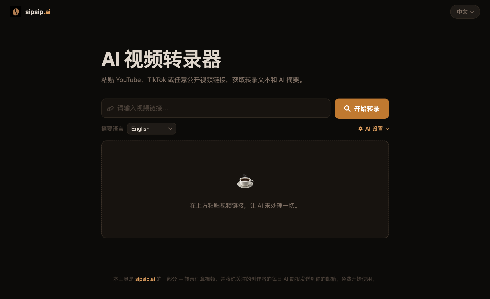

<div align="center">

# AI视频转录器

中文 | [English](README.md)

一款开源的AI视频/播客转录和摘要工具，支持YouTube、Bilibili、抖音、Apple Podcasts、SoundCloud等30+平台。



</div>

## ✨ 功能特性

- 🎥 **多平台支持**: 支持YouTube、Bilibili、抖音、Apple Podcasts、SoundCloud等30+平台
- ⚡ **字幕优先架构**: 对有原生字幕的平台（如YouTube），直接提取字幕文本，无需下载音频，速度大幅提升；无字幕时自动回退至Whisper转录
- 🗣️ **智能转录**: 无字幕时使用Faster-Whisper进行高精度语音转文字
- 🤖 **AI文本优化**: 自动错别字修正、句子完整化和智能分段
- 🌍 **多语言摘要**: 支持多种语言的智能摘要生成
- 🔧 **自定义AI模型**: 在页面中直接配置任意OpenAI兼容接口（OpenAI、OpenRouter、本地LLM等）——输入API地址和Key，点击 **Fetch** 自动获取可用模型并选择
- ⚙️ **条件式翻译**: 当所选摘要语言与转录语言不一致时，自动生成翻译
- 📱 **移动适配**: 完美支持移动设备

## 🚀 快速开始

### 环境要求

- Python 3.8+
- FFmpeg
- 任意OpenAI兼容服务商的API Key（OpenAI、OpenRouter等）—— 直接在页面UI中配置，无需服务器环境变量

### 安装方法


#### 方法一：自动安装

```bash
# 克隆项目
git clone https://github.com/wendy7756/AI-Video-Transcriber.git
cd AI-Video-Transcriber

# 运行安装脚本
chmod +x install.sh
./install.sh
```

#### 方法二：Docker部署

```bash
# 克隆项目
git clone https://github.com/wendy7756/AI-Video-Transcriber.git
cd AI-Video-Transcriber

# 使用Docker Compose（最简单）
cp .env.example .env
# 编辑.env文件设置服务端默认值（可选）
docker-compose up -d

# 或者直接使用Docker
docker build -t ai-video-transcriber .
docker run -p 8000:8000 ai-video-transcriber
```

#### 方法三：手动安装

1. **安装Python依赖**（建议使用虚拟环境）
```bash
# 创建并启用虚拟环境（macOS推荐，避免 PEP 668 系统限制）
python3 -m venv venv
source venv/bin/activate
python -m pip install --upgrade pip
pip install -r requirements.txt
```

2. **安装FFmpeg**
```bash
# macOS
brew install ffmpeg

# Ubuntu/Debian
sudo apt update && sudo apt install ffmpeg

# CentOS/RHEL
sudo yum install ffmpeg
```

3. **配置环境变量**（可选）
```bash
# 如需服务端默认值可设置，否则直接在页面 AI Settings 面板中配置
export OPENAI_API_KEY="your_api_key_here"
export OPENAI_BASE_URL="https://openrouter.ai/api/v1"  # 任意兼容端点
```

### 启动服务

```bash
python3 start.py
```

服务启动后，打开浏览器访问 `http://localhost:8000`

#### 生产模式（推荐用于长视频）

为了避免在处理长视频时SSE连接断开，建议使用生产模式启动（禁用热重载）：

```bash
python3 start.py --prod
```

这样可以在长时间任务（30-60+分钟）中保持SSE连接稳定。

#### 使用显式环境变量启动（示例）

```bash
source venv/bin/activate
export OPENAI_API_KEY=your_api_key_here         # 可选：服务端默认值
# export OPENAI_BASE_URL=https://openrouter.ai/api/v1  # 可选：服务端默认值
python3 start.py --prod
```

## 📖 使用指南

1. **输入视频链接**: 在输入框中粘贴YouTube、Bilibili等平台的视频链接
2. **选择摘要语言**: 在输入框旁的下拉菜单中选择输出语言
3. **（可选）配置AI模型**: 点击 **AI Settings** 展开配置面板
   - 填写 **API Base URL**（如 `https://openrouter.ai/api/v1`）和 **API Key**
   - 点击 **Fetch** 自动拉取该服务商的可用模型列表
   - 选择你想用的模型，不填则使用服务器默认模型
4. **开始处理**: 点击 **Transcribe** 按钮，进度条会显示当前所处的模式：
   - **⚡ Subtitle**（绿色）——检测到原生字幕，秒级提取完成
   - **🎙 Whisper**（橙色）——无字幕，下载音频后转录
5. **查看结果**: 查看优化后的转录文本和AI摘要
   - 若转录语言 ≠ 所选摘要语言，会自动显示 **翻译** 标签页
6. **下载文件**: 点击下载按钮保存Markdown格式文件（转录 / 翻译 / 摘要）

## 🛠️ 技术架构

### 后端技术栈
- **FastAPI**: 现代化的Python Web框架
- **yt-dlp**: 视频下载和处理
- **Faster-Whisper**: 高效的语音转录
- **OpenAI API**: 智能文本摘要

### 前端技术栈
- **HTML5 + CSS3**: 响应式界面设计
- **JavaScript (ES6+)**: 现代化的前端交互
- **Marked.js**: Markdown渲染
- **Font Awesome**: 图标库

### 项目结构
```
AI-Video-Transcriber/
├── backend/                 # 后端代码
│   ├── main.py             # FastAPI主应用
│   ├── video_processor.py  # 视频处理模块
│   ├── transcriber.py      # 转录模块
│   ├── summarizer.py       # 摘要模块
│   └── translator.py       # 翻译模块
├── static/                 # 前端文件
│   ├── index.html          # 主页面
│   └── app.js              # 前端逻辑
├── temp/                   # 临时文件目录
├── Docker相关文件           # Docker部署
│   ├── Dockerfile          # Docker镜像配置
│   ├── docker-compose.yml  # Docker Compose配置
│   └── .dockerignore       # Docker忽略规则
├── .env.example        # 环境变量模板
├── requirements.txt    # Python依赖
└── start.py           # 启动脚本

```

## ⚙️ 配置选项

### 环境变量

| 变量名 | 描述 | 默认值 | 必需 |
|--------|------|--------|------|
| `OPENAI_API_KEY` | API密钥（服务端默认值） | - | 否，可在UI中配置 |
| `HOST` | 服务器地址 | `0.0.0.0` | 否 |
| `PORT` | 服务器端口 | `8000` | 否 |
| `WHISPER_MODEL_SIZE` | Whisper模型大小 | `base` | 否 |

### Whisper模型大小选项

| 模型 | 参数量 | 英语专用 | 多语言 | 速度 | 内存占用 |
|------|--------|----------|--------|------|----------|
| tiny | 39 M | ✓ | ✓ | 快 | 低 |
| base | 74 M | ✓ | ✓ | 中 | 低 |
| small | 244 M | ✓ | ✓ | 中 | 中 |
| medium | 769 M | ✓ | ✓ | 慢 | 中 |
| large | 1550 M | ✗ | ✓ | 很慢 | 高 |

## 🔧 常见问题

### Q: 为什么转录速度很慢？
A: 转录速度取决于视频长度、Whisper模型大小和硬件性能。可以尝试使用更小的模型（如tiny或base）来提高速度。

### Q: 支持哪些视频平台？
A: 支持所有yt-dlp支持的平台，包括但不限于：YouTube、抖音、Bilibili、优酷、爱奇艺、腾讯视频等。

### Q: AI优化功能不可用怎么办？
A: AI功能需要任意OpenAI兼容服务商的API Key（OpenAI、OpenRouter等）。可直接在页面 **AI Settings** 面板中填写，无需重启服务。也可通过 `OPENAI_API_KEY` 环境变量设置服务端默认值。

### Q: 出现 500 报错/白屏，是代码问题吗？
A: 多数情况下是环境配置问题，请按以下清单排查：
- 是否已激活虚拟环境：`source venv/bin/activate`
- 依赖是否安装在虚拟环境中：`pip install -r requirements.txt`
- 是否在页面 **AI Settings** 面板中配置了API Key，或通过 `OPENAI_API_KEY` 环境变量设置
- 是否已安装 FFmpeg：macOS `brew install ffmpeg` / Debian/Ubuntu `sudo apt install ffmpeg`
- 8000 端口是否被占用；如被占用请关闭旧进程或更换端口

### Q: 如何处理长视频？
A: 系统可以处理任意长度的视频，但处理时间会相应增加。建议对于超长视频使用较小的Whisper模型。

### Q: 如何使用Docker部署？
A: Docker提供了最简单的部署方式：

**前置条件：**
- 从 https://www.docker.com/products/docker-desktop/ 安装Docker Desktop
- 确保Docker服务正在运行

**快速开始：**
```bash
# 克隆和配置
git clone https://github.com/wendy7756/AI-Video-Transcriber.git
cd AI-Video-Transcriber
cp .env.example .env
# 编辑.env文件设置服务端默认值（可选）

# 使用Docker Compose启动（推荐）
docker-compose up -d

# 或手动构建运行
docker build -t ai-video-transcriber .
docker run -p 8000:8000 --env-file .env ai-video-transcriber
```

**常见Docker问题：**
- **端口冲突**：如果8000端口被占用，可改用 `-p 8001:8000`
- **权限拒绝**：确保Docker Desktop正在运行且有适当权限
- **构建失败**：检查磁盘空间（需要约2GB空闲空间）和网络连接
- **容器无法启动**：通过 `docker logs <容器ID>` 查看具体错误日志

**Docker常用命令：**
```bash
# 查看运行中的容器
docker ps

# 检查容器日志
docker logs ai-video-transcriber-ai-video-transcriber-1

# 停止服务
docker-compose down

# 修改后重新构建
docker-compose build --no-cache
```

### Q: 内存需求是多少？
A: 内存使用量根据部署方式和工作负载而有所不同：

**Docker部署：**
- **基础内存**：空闲容器约128MB
- **处理过程中**：根据视频长度和Whisper模型，需要500MB - 2GB
- **Docker镜像大小**：约1.6GB磁盘空间
- **推荐配置**：4GB+内存以确保流畅运行

**传统部署：**
- **基础内存**：FastAPI服务器约50-100MB
- **Whisper模型内存占用**：
  - `tiny`：约150MB
  - `base`：约250MB
  - `small`：约750MB
  - `medium`：约1.5GB
  - `large`：约3GB
- **峰值使用**：基础 + 模型 + 视频处理（额外约500MB）

**内存优化建议：**
```bash
# 使用更小的Whisper模型减少内存占用
WHISPER_MODEL_SIZE=tiny  # 或 base

# Docker部署时可限制容器内存
docker run -m 1g -p 8000:8000 --env-file .env ai-video-transcriber

# 监控内存使用情况
docker stats ai-video-transcriber-ai-video-transcriber-1
```

### Q: 网络连接错误或超时怎么办？
A: 如果在视频下载或API调用过程中遇到网络相关错误，请尝试以下解决方案：

**常见网络问题：**
- 视频下载失败，出现"无法提取"或超时错误
- OpenAI API调用返回连接超时或DNS解析失败
- Docker镜像拉取失败或极其缓慢

**解决方案：**
1. **切换VPN/代理**：尝试连接到不同的VPN服务器或更换代理设置
2. **检查网络稳定性**：确保你的网络连接稳定
3. **更换网络后重试**：更改网络设置后等待30-60秒再重试
4. **使用备用端点**：如果使用自定义OpenAI端点，验证它们在你的网络环境下可访问
5. **Docker网络问题**：如果容器网络失败，重启Docker Desktop

**快速网络测试：**
```bash
# 测试视频平台访问
curl -I https://www.youtube.com/

# 测试AI服务商端点
curl -I https://openrouter.ai

# 测试Docker Hub访问
docker pull hello-world
```

如果问题持续存在，尝试切换到不同的网络或VPN位置。

## 🎯 支持的语言

### 转录
- 通过Whisper支持100+种语言
- 自动语言检测
- 主要语言具有高准确率

### 摘要生成
- 英语
- 中文（简体）
- 日语
- 韩语
- 西班牙语
- 法语
- 德语
- 葡萄牙语
- 俄语
- 阿拉伯语
- 以及更多...

## 📈 性能提示

- **硬件要求**:
  - 最低配置: 4GB内存，双核CPU
  - 推荐配置: 8GB内存，四核CPU
  - 理想配置: 16GB内存，多核CPU，SSD存储

- **处理时间预估**:

  | 视频长度 | 字幕模式 | Whisper模式 | 备注 |
  |---------|---------|------------|------|
  | 1分钟 | ≈5秒 | 30秒–1分钟 | 字幕模式无需下载音频 |
  | 5分钟 | ≈10秒 | 2–5分钟 | YouTube自动字幕触发字幕模式 |
  | 15分钟 | ≈15秒 | 5–15分钟 | 大多数YouTube视频支持字幕模式 |
  | 30分钟+ | ≈20秒 | 15–60分钟 | 纯音频/播客始终使用Whisper |

## 🤝 贡献指南

欢迎提交Issue和Pull Request！

1. Fork项目
2. 创建功能分支 (`git checkout -b feature/AmazingFeature`)
3. 提交更改 (`git commit -m 'Add some AmazingFeature'`)
4. 推送到分支 (`git push origin feature/AmazingFeature`)
5. 开启Pull Request 

## 致谢

- [yt-dlp](https://github.com/yt-dlp/yt-dlp) - 强大的视频下载工具
- [Faster-Whisper](https://github.com/guillaumekln/faster-whisper) - 高效的Whisper实现
- [FastAPI](https://fastapi.tiangolo.com/) - 现代化的Python Web框架
- [OpenAI](https://openai.com/) - 智能文本处理API

## 📞 联系方式

如有问题或建议，请提交Issue或联系Wendy。

---

## 🚀 体验完整功能 — sipsip.ai

本工具是 **[sipsip.ai](https://sipsip.ai)** 的开源部分。

完整产品提供更多功能：
- 📧 **每日邮件简报** —— 关注你喜欢的创作者，每天早上收到AI整理的内容摘要
- ⚡ 随时转录和总结任意视频和播客
- 🌐 全功能支持多语言

**免费开始使用** —— 无需绑定信用卡。

➡️ [sipsip.ai](https://sipsip.ai)

---

## ⭐ Star History

如果您觉得这个项目有帮助，请考虑给它一个星星！
